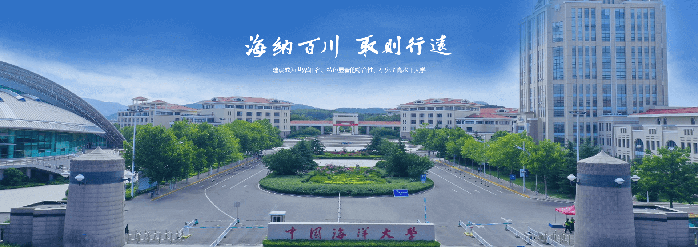

    <h2> China Collegiate Computing Contest
    <h1> Mobile Application Innovation Contest

    <h3> 团队名：Macintustin &nbsp;&nbsp; 作品名：Lost Anchor
    <h3> 队长：赵禹惟 &nbsp;&nbsp; 队员：黄梓洋 
    <h3> 指导老师：高峰

---

## 一、项目简介
本项目为 “第十届中国高校计算机大赛 - 移动应用创新赛”  作品 **Lost Anchor** 的总设计流程，基于 **iPhone / iPad** 的 **AR** 功能实现低门槛、高沉浸感、富有温度的数字地图体验。

> 注： 详见 [**Instruction**](./Instruction.md) 说明文档

---

## 二、成果展示

    

> 注：原视频见 [**演示视频**](./AppContest2025_Macintustin/docs/Macintustin视频.mp4)

---

## 三、项目结构
### 1. 项目主体结构
<pre><code>
AppContest2025_Macintustin/
├── 3DModel/                                 # 储存 3D 锚点模型
│   ├── Drummer.usdz
│   ├── RocketToy.usdz
│   └── ToyBiplane.usdz
│
├── Interface Components/                    # 用户交互主界面
│   ├── HomeView.swift                       # 主界面 (内置2D/AR视图)
│   ├── RecommendationView.swift             # Top10 推荐界面
│   └── UserView.swift                       # 用户设置界面
│
├── Map Components/                          # 地图相关功能模块
│   └── ...
│
├── Assets.xcassets/                         # 存储照片
│   └── ...
│
├── AR Components/                           # AR 功能组件
│   └── ...
│
├── Other Components/
│   ├── AppData.swift                        # App 内置小型数据库
│   └── LikeManager.swift                    # 管理点赞计数和状态持久化
│
├── Photos Components/
│   ├── ImagePicker.swift                    # 从用户照片库中选择多个图像的包装器
│   └── PhotosUpload.swift                   # 照片上传功能模块
│
├── Recommendation Components/
│   ├── CommentSection.swift                 # 照片和评论展示子视图
│   └── PlaceRow.swift                       # 地点展示 UI 管理组件
│
├── User Components/                         # 用户设置界面模块
│   ├── UserDataManager.swift                # 管理用户配置文件数据的单例实用组件
│   └── UserDetailsView.swift                # 用户信息展示 UI
│
├── AppDelegate.swift                        # 用于控制 App 各模块生命周期
├── ContentView.swift                        # 三大主视图缝合 Toolbar
└── StartView.swift                          # App 启动界面
</code></pre>

### 2. 子模块分结构

 AR 功能组件结构 

<pre><code>
AR Components/                           # AR 功能组件
├── ARSessionHandler.swift               # 用于在增强现实视图中处理AR会话事件
├── ARViewContainer.swift                # 集成 RealityKit 的 ARView 和 SwiftUI 的容器视图
├── AugmentedRealityView.swift           # AR 界面主界面
├── GestureHandler.swift                 # 在 AR 视图中处理用户手势交互
├── LabelEntityBuilder.swift             # 用于在 RealityKit 场景中生成标记的UI元素
└── ModelPlacementHandler.swift          # 用于根据检测到的表面和位置在 AR 场景中放置 3D 模型
</code></pre>

 地图功能组件结构 

<pre><code>
Map Components/                          # 地图相关功能模块
├── DetailsView Components/              # 地图功能细化模块
├── CommentView.swift                    # 特定位置编写、编辑和保存注释的视图
├── EmptyPhotoPlaceholderView.swift      # 当没有照片时显示的占位视图
│   ├── HeartButtonView.swift            # 一个喜欢按钮视图，可选的评论提示和弹窗支持
│   ├── LocationDetailsHeaderView.swift  # 显示位置名称和标题的标题视图
│   ├── NavigationButtonsView.swift      # 为基于地图的方向提供导航控制按钮的视图
│   └── PhotoCarouselView.swift          # 照片轮播视图显示可滑动的本地图像库
├── LocationDetailsView.swift            # 显示位置信息、照片和导航控件的详细视图。
└── PlainView.swift                      # 一个提供地图搜索、选择和导航功能的SwiftUI视图。
</code></pre>

---

## 四、开发流程
### Part I. 设计平面地图 UI 并实现基本定位导航功能
1. **参考信息**：
- 高德地图api - [iOS-地图-SDK](https://lbs.amap.com/api/ios-sdk/summary)
- Youtube - [AMAZING NEW SwiftUI MapKit Features | iOS 17 | WWDC23](https://www.youtube.com/watch?v=gy6rp_pJmbo&t=247s)
- Apple Doc. - [MapKit](https://developer.apple.com/documentation/mapkit/)
- Apple Doc. - [CoreLocation](https://developer.apple.com/documentation/CoreLocation)
2. **具体细节**：
- 起初因为 Apple Map 在国行设备上的支持问题我打算采用高的地图的 api，但是实际上手后发现高德地图的 iOS 开发文档停留在 swift 早期阶段，新版 swift deprecate(弃用) 很多早期语法导致兼容性很差，最终效果欠佳。
- 不得已我在 YouTube 上搜索到相应视频支持 WWDC2023 之后的 swift 平面地图 api 快速搭建教程，并结合 Apple Doc. 中对 MapKit 和 CoreLocation 的详细说明最终实现平面地图的搭建。

### Part II. 设计用户点赞留言系统
1. **参考信息**：
- Apple Doc. - [SwiftUI](https://developer.apple.com/documentation/SwiftUI)
- 点赞周期的生命周期控制，详见 [AppDelegate.swift](./AppContest2025_Macintustin/AppDelegate.swift)
2. **具体细节**：
- 设计对应 UI 组件然后缝合
- 注意用户的点赞留言随 App 的生灭过程的持续性，即控制各组件的生命周期

### Part III. 设计 Top10 展示 UI 界面
> 注：同 Part II

### Part IV. 设计 AR 视图并与平面中各功能组件缝合
1. **参考信息**：
- Youtube - [Mobile Apple AR Tutorials (RealityKit/ARKit)](https://www.youtube.com/watch?v=jjCsI56XavI&list=PLb0SG4T4tfPyQF-hMntGxaKqUJOKZQ2QX)
- Apple Doc. - [RealityKit](https://developer.apple.com/documentation/RealityKit)
- Apple Doc. - [ARKit](https://developer.apple.com/documentation/ARKit)

2. **具体细节**：
- 吸取平面地图的教训这次直接从 Google / YouTube 作为切入点找到了对应 AR 搭建教程视频
- 结合 Apple Doc. 中对 RealityKit & ARKit 的详细说明实现 AR 视图的搭建

### Part V. 调整 UI 布局，控制各模块生命周期
### Part VI. 设计用户设置界面
### Part VII. (Waiting...)

---

## 五、不足及未来展望
### 1. 不足
- 由于时间有限我们不得不在一定程度上牺牲 UI 的美观性
- App 的生命周期管理也没有控制的特别好，长时间运行下会导致内存泄露
- 人机交互的反馈感不是很强
- AR 视图的 3D 导航功能没有搭建起来
- 用户设置视图没有搭建完成
### 2. 未来展望
- 将上述不足改正
- 引入自己创建的 3D 模型，将 UI 改成 Liquid Glass 风格通过 `metal4` 实现系统级光追效果
- 加入触感回弹反馈
- 将端侧数据通过服务器整合，轻量化端侧大小
- 基于服务器设置**社区活动**，增强 App 的人与人的沟通性

#### ⚠️ License: 该项目非开源. 详见 [LICENSE](./LICENSE).

---

